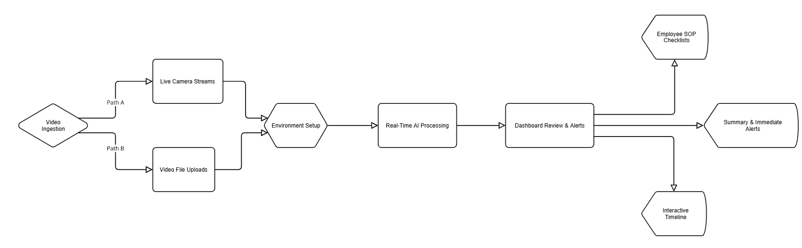

# Sentinel.ai: AI-Powered Operational Compliance & Security

## Project Overview

**Sentinel.ai** is an intelligent monitoring platform that acts as a digital guard for business operations. It leverages AI to automatically analyze work videos in **real-time**, verifying employee compliance with Standard Operating Procedures (SOPs) **and instantly detecting suspicious activities or safety alerts.** This provides a dual benefit: enabling managers to ensure operational consistency while also enhancing site security and immediate incident response.

## Team Introduction

1.  **Somya Ranjan Sahoo** - Software Engineer at Confluent
2.  **Darshan** - Software Engineer at Commvault
3.  **Shivansh Gupta** - Software Engineer at Boeing

**Fun Fact** - We all are from same college.

## Architecture

## Key Challenges & Limitations

1.  **AI Accuracy in Complex Environments:** Vision Language Models (VLMs) struggle in busy scenes with multiple, overlapping actions. **The ambiguity of "suspicious activity" makes the system more prone to false positives** than simple SOP checks, requiring careful calibration.
2.  **High Cost of Scaling:** **Real-time analysis** of multiple high-resolution video streams is **even more** computationally intensive than post-processing. The associated costs for GPUs, data storage, and high-speed networking create a significant financial barrier to large-scale deployment.
3.  **Impact on Employee Morale:** Constant AI monitoring can increase employee stress and erode trust. This sense of pervasive surveillance may negatively impact productivity and increase turnover.
4.  **Risk of Algorithmic Bias:** AI models trained on biased data can learn and amplify those biases. **This risk is significantly amplified when defining "suspicious activity,"** where the AI could disproportionately flag individuals based on biased training data, leading to unfair assessments and legal challenges.
5.  **Legal & Data Privacy Compliance:** Employee monitoring is highly regulated. In India, the Digital Personal Data Protection (DPDP) Act of 2023 imposes strict rules on data collection, consent, and purpose. Ensuring full compliance is a complex legal necessity.

## Technology Stack

### 1. Front-End: Web Application Interface
* **HTML/CSS:** For semantic structure, styling, and a responsive user experience.
* **JavaScript (JS):** Powers client-side interactivity, manages video uploads, and handles asynchronous API communication to display analysis results **and real-time alerts**.

### 2. Back-End: API and Core Logic
* **Python:** The primary back-end language, chosen for its robust AI/ML ecosystem.
* **FastAPI:** A high-performance Python framework used to build the RESTful API. Its asynchronous capabilities are critical for managing long-running video processes **and handling persistent, real-time data streams.**

### 3. Databases: Dual-Database Strategy
* **SQLite:** A lightweight SQL database for storing structured metadata (user info, video details, SOP definitions, and results).
* **ChromaDB:** An open-source vector database that stores video frame embeddings, enabling
    efficient semantic search and retrieval fundamental to the AI's analysis.

### 4. Computer Vision & Cross-Camera Intelligence
* **YOLOv11:** A state-of-the-art model used for initial object detection to identify all individuals in a scene.
* **Person Re-Identification (Re-ID):** This model assigns a unique, persistent ID to each person, enabling `Sentinel.ai` to track employees across different camera views. This is critical for verifying compliance with multi-step SOPs **and tracking suspicious behavior over time.**

## Partner Spotlight: Runware.ai

To accelerate development and ensure robust testing, `Sentinel.ai` partnered with `runware.ai` to generate synthetic video data.

* **Controlled Scenario Generation:** We used `runware.ai`'s Text-to-Video and Image-to-Video features to create specific test cases (e.g., "ideal" vs. "failed" SOPs) that would be difficult to film manually.
* **Targeted Compliance Testing:** This allowed us to generate videos depicting specific SOP failures (e.g., an employee not greeting a customer) **as well as videos depicting suspicious activities (e.g., loitering in a restricted area)** to validate that `Sentinel.ai` correctly flagged the deviation.
* **Edge Case & Robustness Validation:** We created scenes with varied lighting, camera angles, and crowd densities to test the resilience of our YOLOv11 and Re-ID models.

## Future Roadmap

Our roadmap focuses on expanding analytical depth, architectural scale, and workflow integration.

### 1. Enhanced AI & Analytical Capabilities
* **Advanced Behavioral Analysis:** Move beyond procedural checks to analyze more nuanced non-verbal cues like gestures, posture, and gaze patterns. This would allow `Sentinel.ai` to provide deeper insights into the quality of employee-customer interactions.
* **Predictive Anomaly Detection:** Implement unsupervised learning models to establish a baseline of "normal" operational behavior. This would enable the system to automatically flag any unusual or unexpected events that deviate from the norm, **even if they are not part of a predefined SOP or threat model.**
* **Conversational AI Interface:** Integrate a natural language query feature, allowing managers to "talk" to their data (e.g., "Show me all instances of non-compliance at checkout 3 this week" or "List all security alerts from the evening shift").

### 2. Architecture & Scalability
* **Production-Grade Database Migration:** Transition from SQLite to a more robust, production-ready database like PostgreSQL to provide better support for concurrent write operations and horizontal scaling.
* **Hybrid Cloud-Edge Architecture:** Develop a hybrid processing model where initial, lightweight tasks (like person detection) are handled on edge devices at the store location. This would reduce latency and bandwidth costs, while more computationally intensive analysis is sent to the cloud.

### 3. User Experience & Workflow Integration
* **Automated SOP Generation:** Enhance the platform to analyze videos of top-performing employees and automatically generate a "best practice" video SOP or a documented workflow.
* **Integration with HR & Training Platforms:** Create API integrations to connect `Sentinel.ai` with existing Learning Management Systems (LMS) and HR software. This would allow insights from the analysis to automatically trigger personalized training modules or inform data-driven performance reviews.

### 4. Ethical AI & Privacy Enhancements
* **Advanced Privacy-Preserving Features:** Implement state-of-the-art anonymization techniques, such as automatic blurring or masking of faces and other personally identifiable information (PII), to further protect the privacy of both employees and customers.
* **Bias Auditing and Mitigation Tools:** Develop a dedicated module for regularly auditing the AI models for algorithmic bias. This will help ensure that evaluations remain fair and equitable across all demographics.

[Sample Videos](https://drive.google.com/drive/folders/10TubcKfi1VbarbheSj9ax1XIuVSduZ5P?usp=sharing)

[Demo Video Link](https://youtu.be/HYRcnFU8ahM)